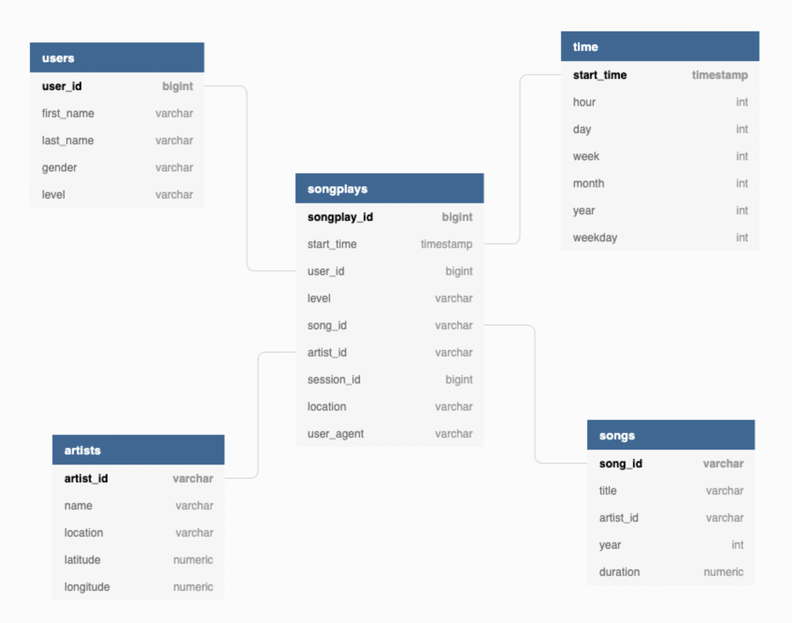

## Purpose of the Database

Sparkify, a music streaming startup, wants to evaluate the data they've collected on songs and user activity on their new application. Data is stored in a directory containing JSON logs of user activity on the application, and in a directory containing JSON metadata on the songs in their app. Their goal is to understand what the consumers are listening to from these music data.

## Database schema design.
* Data modeling was done with help of PostgreSQL.
* Star Schema was chosen, as the data contains 1 to many relationships and so to define fact and dimensional tables.

## Fact and Dimension tables

### Fact table
Records associated with Songplays.

### Dimension tables 

Users table :- users present in the application.

songs - songs from the music database.

artists - artists from music database.

time - timestamps of records in songplays broken down into specific units.

### Run the python scripts

# Commands to run

Open the python console for running python scripts and notebook for ipynb.

python create_tables.py
python etl.py

create_tables.py drops if database exits and creates if not exits by importing queries from the sql_queries.py. To test whether the database is created or not, test.ipynb must be run and checked, next the etl.ipynb file must be run to perform extract, transform and loading into the database.

### Files and Folders discription

data - Folder containing .JSON source files.
create_tables.py - Script that drops and creates tables.
sql_queries.py - Python script containing all the SQL queries required.
etl.ipynb - Jupyter notebook file that is used to ingest one row or rows from Json file.
etl.py - Python script to load the whole datasets.
Design_image.png - ERD diagram depecting the tables and their relationships.
test.ipynb - Jupyter notebook to verify the ingested data.

### Scehema 

### ETL pipeline

Extract transform and load(ETL) pipeline was built using python to ingest source data from json files to relational tables. Pandas library was used to perform any data transformations or filters.

